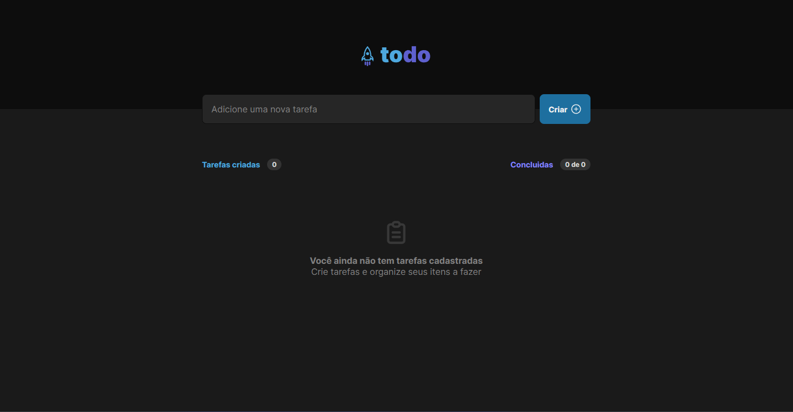
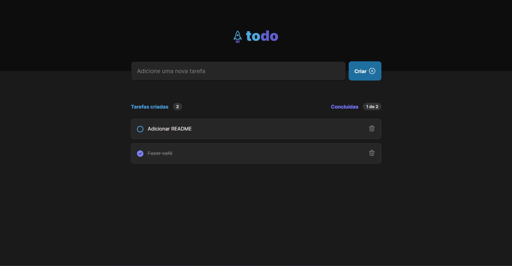

## Desafio 01 | To-do List 

&nbsp;

## Sobre o projeto

Neste desafio foi proposto a criação de um to-do simples, utilizando conceitos do React para a desenvolver do zero uma lista com as opçoes de criar e apagar um item e dois contadores, um indicando a quantidade de tarefas criadas e o outro a quantidade de tarefas totais e as ja concluidas .

<br />


<br />

<br />

## Nesse projeto foi utilizado

- Vite
- CSS Modules
- Typescript
- Local Storage

## Organização de pastas e arquivos

```shell
/
 src/
   assets/
   components/
   styles/
   app.tsx
   main.tsx
   vite-env.d.ts
```

## Comandos de inicialização:

Para Instalar as dependencias.

```
 yarn
```

Para rodar a aplicação.

```
 yarn dev
```
